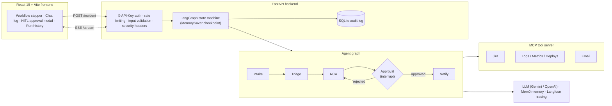

<h1 align="center">Incident Response Agent</h1>

<p align="center">
  <strong>An AI multi-agent system that automates incident triage, root cause analysis, and on-call notification — with a mandatory human-in-the-loop approval gate before anything is sent.</strong>
</p>

<p align="center">
  Built with LangGraph, MCP, Mem0, Langfuse, FastAPI, and React 19.
</p>

<p align="center">
  <a href="#"></a>
  <a href="#"></a>
  <a href="#"></a>
  <a href="#"></a>
  <a href="#"></a>
  <a href="./LICENSE"></a>
</p>

---

> **Why this project?** Real on-call work is mostly the same loop: pull logs, correlate
> with recent deploys, write the RCA, page the team. This system runs that loop with a
> graph of cooperating LLM agents, keeps a full audit trail of every decision, and — critically —
> **never notifies anyone without explicit human approval.** It is designed for a SOC/SRE
> context where automation must be auditable and safe.

## What It Does

When an incident fires, an SRE typically has to manually:
- Pull logs and metrics
- Figure out what changed (deployments, config)
- Write up a root cause analysis
- Notify the on-call team

This agent does all of that automatically — and pauses for human approval before sending any notifications.

**Alert fires → Agent investigates → Human approves → Team notified**

---

## The 5-Agent Workflow

```
Intake → Triage → RCA → Approval (HITL pause) → Notify
```

| Agent | What it does |
|-------|-------------|
| **Intake** | Fetches incident details from Jira (title, description, reporter, priority) |
| **Triage** | Assigns severity (P1–P4), identifies affected systems, queries Mem0 for similar past incidents |
| **RCA** | Queries logs, metrics, and deployment history — LLM identifies root cause and recommends a fix |
| **Approval** | Human-in-the-loop interrupt — workflow pauses until an authorized approver accepts or rejects |
| **Notify** | Sends email notification with full RCA summary to the on-call team |

---

## Architecture



The graph **interrupts before the `approval` node**. State is checkpointed, so the workflow
can pause indefinitely waiting for a human and resume exactly where it left off — that is what
makes the human-in-the-loop gate reliable rather than a race.

---

## Screenshots

> _Placeholder — add UI captures here._
>
> | Workflow stepper | HITL approval modal | Run history / audit log |
> |---|---|---|
> | `docs/screenshots/stepper.png` | `docs/screenshots/approval.png` | `docs/screenshots/history.png` |

---

## Tech Stack

| Layer | Technology |
|-------|-----------|
| **Orchestration** | [LangGraph](https://langchain-ai.github.io/langgraph/) — stateful multi-agent workflow with MemorySaver checkpointing for HITL persistence |
| **LLM** | Google Gemini 2.5 Flash via `langchain-google-genai` (swap to OpenAI via `LLM_PROVIDER=openai`) |
| **Tools** | [MCP](https://modelcontextprotocol.io/) — modular tool server (Jira, logs, metrics, email) |
| **Memory** | [Mem0](https://mem0.ai/) — remembers past incidents and resolutions across runs |
| **Observability** | [Langfuse](https://langfuse.com/) — full LLM tracing, token usage, latency per agent |
| **Streaming** | [AG-UI](https://github.com/ag-ui-protocol/ag-ui) — SSE protocol for real-time frontend updates |
| **Backend** | FastAPI + uvicorn |
| **Frontend** | React 19 + TypeScript + Vite |
| **Audit log** | SQLite — persists every run with agent outputs, approval decision, and timestamps |
| **Rate limiting** | slowapi — 10 req/min on POST /incident, 20 req/min on POST /approve |

---

## Demo Incidents

| ID | Service | Issue | Severity |
|----|---------|-------|----------|
| `INC-101` | Auth service | Redis connection pool reduced by deployment → 97% cache miss rate → OOMKill | P1 |
| `INC-205` | Payment service | ORM migration didn't port connection pool config → PostgreSQL connection exhaustion | P2 |
| `INC-312` | Notification service | Marketing deploy accidentally applied unsubscribe logic to transactional emails → AWS SES suspended | P2 |

> Jira tickets, logs, and incident data are mocked for demo purposes. Integration layer is built and ready for real credentials.

---

## Project Structure

```
incident-response-agent/
├── backend/
│   ├── agents/
│   │   ├── intake_agent.py       # Fetches incident from Jira
│   │   ├── triage_agent.py       # Assigns severity and affected systems
│   │   ├── rca_agent.py          # Root cause analysis via logs + LLM
│   │   ├── notify_agent.py       # Sends email notification
│   │   └── llm_factory.py        # Gemini / OpenAI provider switch
│   ├── api/
│   │   └── main.py               # FastAPI routes + SSE streaming + rate limiting
│   ├── audit/
│   │   └── log.py                # SQLite audit log — persists every run
│   ├── data/                     # Runtime SQLite DB (gitignored)
│   ├── graph/
│   │   ├── workflow.py           # LangGraph graph definition
│   │   ├── nodes.py              # Node wrappers + routing logic
│   │   └── state.py              # IncidentState schema
│   ├── mcp_server/
│   │   └── tools/
│   │       ├── jira_tools.py     # Jira integration (mock → real via API token)
│   │       ├── log_tools.py      # Log/metrics/deployment data (mock → Splunk/Loki)
│   │       └── email_tools.py    # Email sending (mock → SMTP/SendGrid)
│   ├── memory/
│   │   └── mem0_client.py        # Mem0 for cross-run incident memory
│   ├── observability/
│   │   └── langfuse_client.py    # Langfuse tracing
│   ├── config.py                 # Env var loading
│   └── requirements.txt
├── frontend/
│   └── src/
│       ├── components/
│       │   ├── ChatUI.tsx             # Real-time chat event log
│       │   ├── WorkflowStepper.tsx    # Visual 5-step progress indicator
│       │   ├── IncidentDetails.tsx    # Live state panel
│       │   ├── HITLApprovalModal.tsx  # Human review modal
│       │   └── RunHistory.tsx         # Audit log table with search/filter
│       ├── hooks/
│       │   └── useAgentStream.ts      # SSE event consumer
│       └── api/
│           └── client.ts             # Axios API client
├── tests/                        # 146 tests, 87% coverage, no network/creds needed
│   ├── conftest.py               # Shared FakeLLM fixture + mocks
│   ├── test_agents.py            # Agent helper functions
│   ├── test_agent_pipeline.py    # Full agent run_* functions with mocked LLM
│   ├── test_api.py               # Input validators + safe-state allowlist
│   ├── test_api_endpoints.py     # HTTP-level auth / validation / response shape
│   ├── test_audit_log.py         # SQLite audit log store
│   ├── test_clients.py           # Mem0 / Langfuse graceful degradation
│   ├── test_config.py            # Startup config validation
│   ├── test_graph.py             # Graph routing + node wiring
│   ├── test_mcp_server.py        # MCP tool registrations
│   └── test_tools.py             # Enrichment tools (logs/metrics/jira/email)
├── .github/
│   ├── workflows/
│   │   ├── ci.yml                # Lint (ruff) + type-check (mypy) + pytest + frontend build
│   │   ├── security.yml          # bandit + pip-audit + gitleaks + Trivy image scan
│   │   └── codeql.yml            # CodeQL (python + js/ts), security-extended
│   └── dependabot.yml            # Weekly pip / npm / docker / actions updates
├── backend/Dockerfile            # Non-root, healthcheck'd backend image
├── docker-compose.yml            # Local Langfuse + Postgres observability stack
├── pyproject.toml                # ruff / pytest / coverage / mypy config
├── start.sh                      # macOS one-click startup
├── start.ps1                     # Windows one-click startup
└── .env                          # Secrets — never committed
```

---

## Running Locally

### Prerequisites
- Python 3.11+
- Node.js 18+
- A `.env` file in the project root (see below)

### Quick start (macOS)
```bash
./start.sh
```
Opens both servers in separate Terminal windows automatically.

### Quick start (Windows)
```powershell
.\start.ps1
```

### Manual start

**Backend** (run from project root):
```bash
python -m venv .venv
source .venv/bin/activate      # Windows: .venv\Scripts\Activate.ps1
pip install -r backend/requirements.txt
uvicorn backend.api.main:api --reload --port 8000
```

**Frontend:**
```bash
cd frontend
npm install
npm run dev
```

Open **http://localhost:5173** (or 5174 if 5173 is in use).

### Running Tests
```bash
source .venv/bin/activate
pip install -r backend/requirements.txt -r backend/requirements-dev.txt
pytest tests --cov=backend --cov-report=term-missing
```
**146 tests, 87% coverage** — no network, LLM keys, or external services required. The LLM and
all external calls (Mem0, Jira, SMTP) are mocked via fixtures in `tests/conftest.py`.

### Lint & Security Scans (run what CI runs)
```bash
ruff check backend tests          # lint
mypy backend                      # type-check
bandit -r backend -ll             # static security analysis
pip-audit -r backend/requirements.txt   # dependency CVE audit
```

### Docker
```bash
docker build -f backend/Dockerfile -t ir-agent-backend .
docker run -p 8000:8000 --env-file .env ir-agent-backend
```

---

## Environment Variables (`.env` in project root)

```env
# LLM — required
GEMINI_API_KEY=your_gemini_key

# LLM provider — "gemini" (default) or "openai"
LLM_PROVIDER=gemini
OPENAI_API_KEY=                    # required if LLM_PROVIDER=openai

# API auth — leave blank to run in dev mode (no key required)
API_KEY=

# Jira (optional — mocked if not set)
JIRA_URL=https://yourorg.atlassian.net
JIRA_EMAIL=you@yourorg.com
JIRA_TOKEN=your_jira_api_token

# Email / SMTP (optional — mocked if not set)
SMTP_HOST=smtp.gmail.com
SMTP_PORT=587
SMTP_USER=you@gmail.com
SMTP_PASSWORD=your_app_password

# Observability (optional — graceful fallback if not set)
MEM0_API_KEY=your_mem0_key
LANGFUSE_PUBLIC_KEY=your_public_key
LANGFUSE_SECRET_KEY=your_secret_key
LANGFUSE_HOST=http://localhost:3001   # local Docker instance
```

---

## API Endpoints

| Method | Path | Auth | Description |
|--------|------|------|-------------|
| `POST` | `/incident` | API key | Start a new incident workflow |
| `GET` | `/stream/{run_id}` | — | SSE stream of AG-UI events |
| `POST` | `/approve/{run_id}` | API key | Submit approval / rejection |
| `GET` | `/runs` | API key | List all past runs (audit log) |
| `GET` | `/runs/{run_id}` | API key | Full detail for a single run |
| `GET` | `/incidents/search` | API key | Semantic search over Mem0 memory |
| `GET` | `/health` | — | Health check |

---

## Swapping Mocks for Real Integrations

Everything is built with a clear swap point — the agent logic doesn't change, only the data source.

| Mock | Real integration | What to change |
|------|-----------------|----------------|
| Jira mock | Jira REST API | Set `JIRA_URL`, `JIRA_EMAIL`, `JIRA_TOKEN` in `.env` |
| Log mock | Splunk / Loki / Datadog | Replace `query_system_logs()` in `log_tools.py` |
| Email mock | Gmail / SendGrid / SES | Set `SMTP_*` vars in `.env` |
| SQLite checkpointer | PostgreSQL | Swap `MemorySaver` for `PostgresSaver` in `workflow.py` |

---

## Security

- **Auth** — POST endpoints and audit log protected by `X-API-Key` header; blank `API_KEY` enables dev mode
- **Rate limiting** — 10 req/min on `POST /incident`, 20 req/min on `POST /approve`
- **Input validation** — incident ID format enforced (`INC-NNNN`), approver name and notes sanitized against prompt injection (control chars stripped, max length enforced)
- **State allowlist** — internal fields (`notification_recipients`, `messages`, `similar_incidents`) are never sent to the browser
- **Memory injection cap** — Mem0 context truncated to 500 chars per entry to prevent RAG data poisoning
- **Security headers** — `X-Content-Type-Options`, `X-Frame-Options`, `Referrer-Policy` on every response
- **Langfuse TLS** — warns if `LANGFUSE_HOST` points to a remote host over plain HTTP
- **Startup validation** — `validate_config()` fails fast on a missing LLM key and loudly warns when auth is disabled
- **No committed secrets** — all credentials come from environment variables; see [`SECURITY.md`](./SECURITY.md)

For vulnerability reporting and the full security posture, see [`SECURITY.md`](./SECURITY.md).

---

## Engineering Practices

| Area | Tooling |
|------|---------|
| **CI** | GitHub Actions — ruff lint, mypy type-check, pytest (Python 3.11 & 3.12 matrix), frontend build |
| **Coverage gate** | `--cov-fail-under=80` enforced in CI |
| **SAST** | Bandit on every push/PR |
| **Dependency audit** | pip-audit (weekly + on PR) |
| **Secret scanning** | gitleaks on full history |
| **Container scanning** | Trivy on the built backend image + filesystem (SARIF → GitHub Security tab) |
| **Code scanning** | CodeQL (`security-extended`) for Python and TypeScript |
| **Dependency updates** | Dependabot — pip, npm, Docker, GitHub Actions |
| **Reproducibility** | Fully pinned `requirements.txt` |

---

## Roadmap

- [ ] PagerDuty / Prometheus webhook trigger (zero-touch incident creation)
- [ ] Slack / Teams notification channel
- [ ] SSO on the approval modal (restrict to authorized SREs)
- [ ] Reject flow re-runs RCA with approver feedback
- [ ] Real Jira, email, and log integrations (credentials pending)

---

## Contributing

Contributions are welcome — see [`CONTRIBUTING.md`](./CONTRIBUTING.md) for the dev setup,
coding standards, and the checks your PR must pass.

## License

Released under the [MIT License](./LICENSE).

## Author

**Basit Sherazi** — Cybersecurity & AI Engineering
